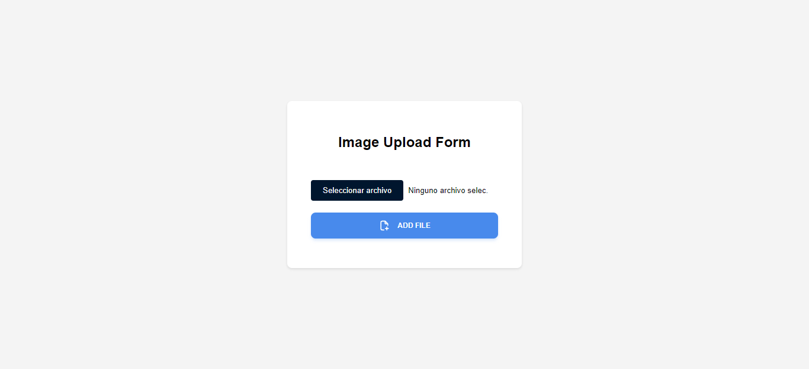
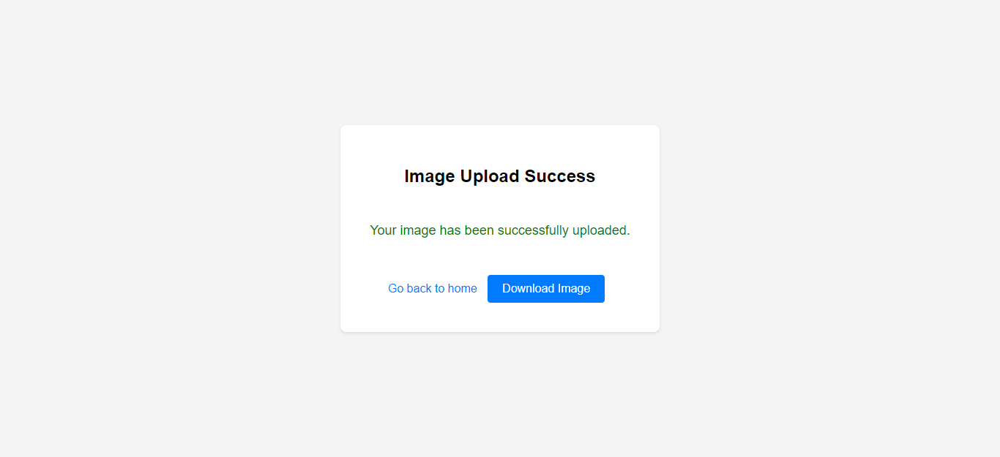
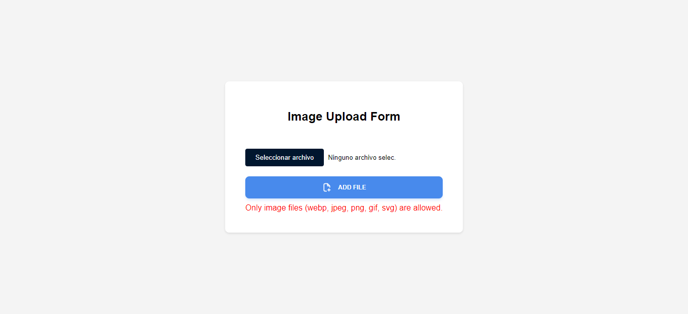

# fireUploader | Express.js

<div align="center">
  <a href="https://postimg.cc/rDFYXKw8">
    
  </a>
</div>

Este es un formulario web simple que permite a los usuarios cargar imágenes. El proyecto está siendo desarrollado utilizando HTML, CSS y JavaScript

[](https://creativecommons.org/licenses/by-nc-nd/4.0/)

[](https://github.com/ninjusdev/firaUpload/stargazers)

## Deployment

1. Clona este repositorio en tu máquina local:

```bash
git clone https://github.com/ninjusdev/image-uploader-api.git
```

2. Inicia el servidor de Express.js en tu servidor local

```bash
bun run dev
```

3. Haz clic en el área designada o en el botón para seleccionar y cargar una imagen.
4. Si todo está bien, la imagen se cargará correctamente. En caso de error, se mostrará un mensaje de error.

## Features

- Carga de Imágenes: Los usuarios pueden hacer clic en el área designada o en el botón para seleccionar y cargar imágenes.

- Validación de Archivos: Se valida que solo se carguen archivos de imagen con extensiones de archivo válidas, como webp, jpeg, png, gif y svg.

- Mensajes de Error: Si no se selecciona ningún archivo o se selecciona un archivo no válido, se muestra un mensaje de error al usuario para informar sobre el problema.

- Interfaz Intuitiva: La interfaz de usuario es simple e intuitiva, facilitando la interacción de los usuarios con el formulario de carga de imágenes.

- Feedback Instantáneo: Los usuarios reciben feedback instantáneo sobre el estado de la carga de imágenes, lo que mejora la experiencia de usuario y reduce la confusión.

- Facilidad de Uso: El formulario de carga de imágenes es fácil de usar y entender, lo que lo hace accesible para una amplia gama de usuarios, incluso aquellos con poca experiencia técnica.

- Tecnologías Web: Desarrollado utilizando tecnologías web estándar como HTML, CSS y JavaScript, lo que garantiza su compatibilidad y accesibilidad en diversos entornos de navegadores web.

- Personalización: El código del formulario es modular y fácil de personalizar, lo que permite a los desarrolladores adaptarlo según las necesidades específicas de sus proyectos.

## Usage/Examples

Cargar una imagen:

- Haga clic en el área designada para cargar una imagen o arrastre y suelte un archivo de imagen en el área del formulario.

- Selecciona un archivo de imagen válido en los formatos admitidos (webp, jpeg, png, gif, svg).

- Si el archivo seleccionado no es una imagen válida o no se selecciona ningún archivo, se mostrará un mensaje de error.

Enviar la imagen:

- Después de seleccionar la imagen, haga clic en el botón "ADD FILE" para enviarla al servidor.

- Si la imagen se envía correctamente, se mostrará un mensaje de estado indicando el éxito del envío.

- Si ocurre algún error durante el proceso de carga, se mostrará un mensaje de error correspondiente.

Visualizar el resultado:

- Después de que la imagen se haya cargado correctamente, puede verificarla abriendo la ruta especificada en el servidor donde se almacenan las imágenes.

- Gestión de Errores: Si ocurre algún error durante la carga de la imagen, se mostrará un mensaje de error específico, indicando la naturaleza del problema y proporcionando orientación sobre cómo corregirlo.

- Personalización: Puede personalizar el formulario y los estilos según sus necesidades, modificando el HTML, CSS y JavaScript proporcionados. Además, puede agregar funcionalidades adicionales o integrar el formulario en aplicaciones web existentes según sea necesario.





## Tech Stack

**Client:**

- HTML: Lenguaje de marcado utilizado para la estructura y el contenido del formulario de carga de imágenes.

- CSS: Estilos utilizados para dar formato al formulario y sus elementos, proporcionando una apariencia visual atractiva y coherente.

- JavaScript: Utilizado para la validación de archivos y la interactividad del formulario, como la detección de cambios en la selección de archivos y la presentación de mensajes de error.

- SVG: Gráficos vectoriales escalables utilizados para los iconos, garantizando una calidad visual nítida y adaptable a diferentes tamaños de pantalla.

**Server:**

- Express.js: Marco de aplicación web de Node.js utilizado para crear y manejar rutas del servidor y proporcionar una API para la comunicación entre el cliente y el servidor.

- Multer: Middleware de Node.js utilizado para manejar la carga de archivos, permitiendo que el servidor reciba archivos enviados desde el cliente.

- Path: Módulo de Node.js utilizado para manejar y transformar rutas de archivos y directorios en el servidor.

## Contributing

Si deseas contribuir a este proyecto, sigue estos pasos:

1. Realiza un fork del repositorio.

2. Crea una nueva rama para tu función: git checkout -b mi-fork.

3. Realiza tus cambios y haz commit: git commit -m "New update".

4. Sube los cambios a tu repositorio en GitHub: git push origin mi-fork.

5. Crea un nuevo pull request en el repositorio original.

6. Espera la revisión y aprobación del pull request.

> [!WARNING] Recuerda leer el codigo de conduta en **contributing.md**

## Authors

- [@ninjusdev](https://www.github.com/ninjusdev)
